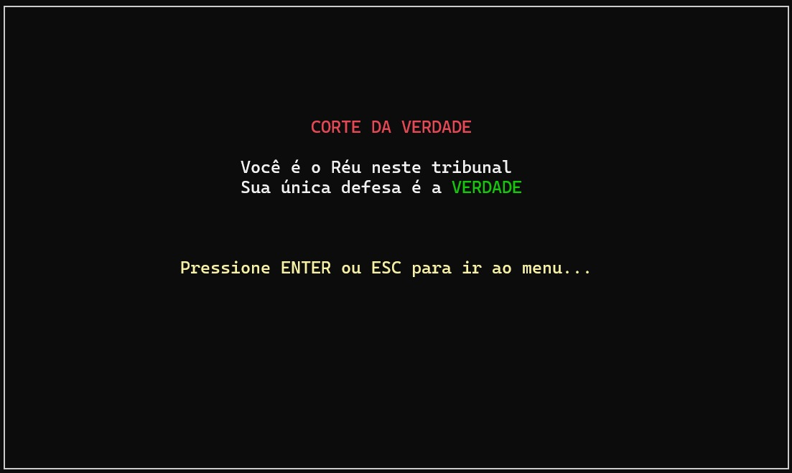
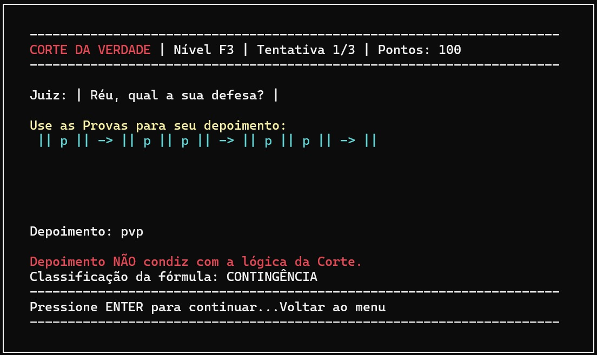
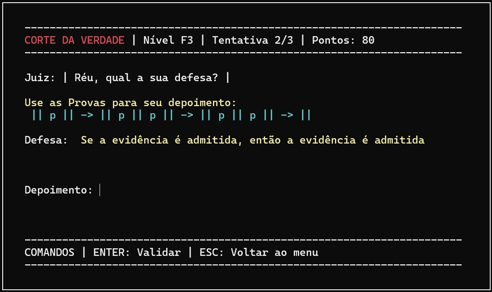
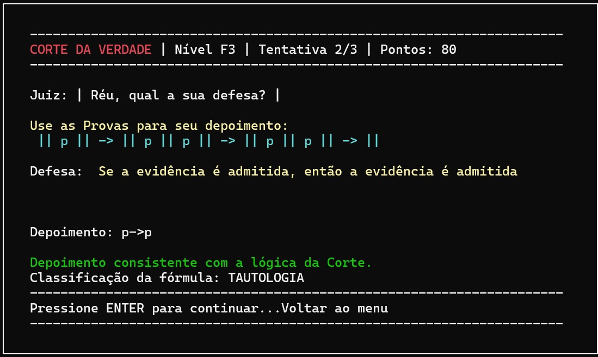
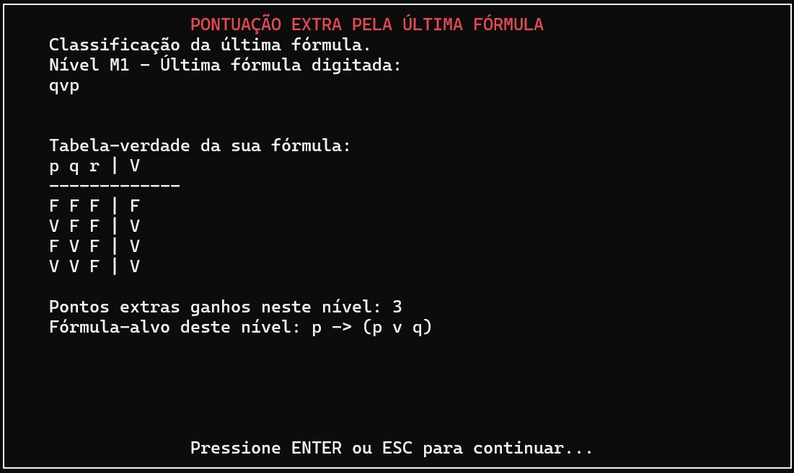
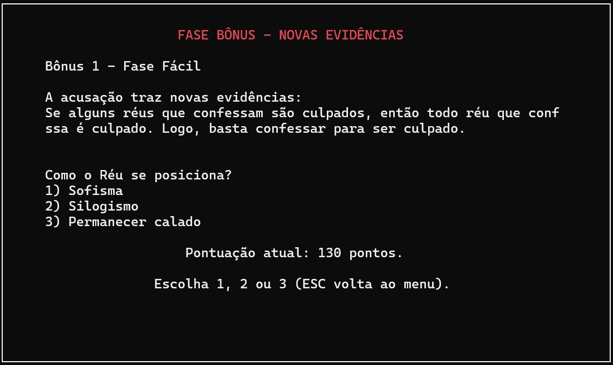
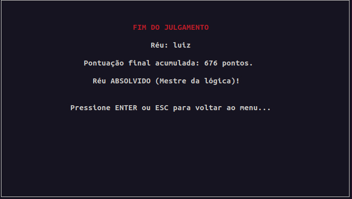
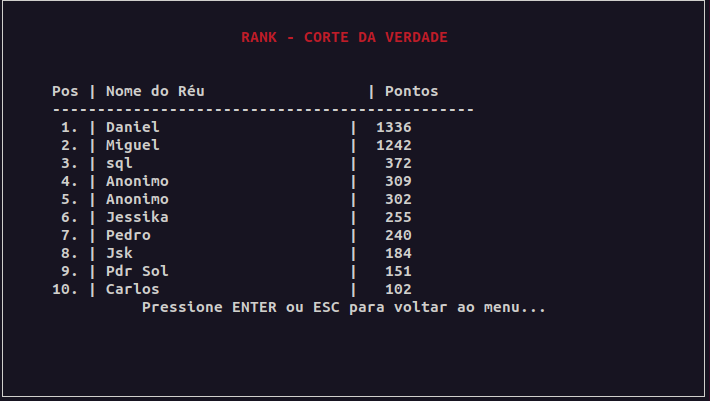

# 🏛️ Corte da Verdade
## 🎮 Jogo Educativo de Lógica Proposicional

---

---
O Corte da Verdade é um jogo interativo e educativo no qual o jogador assume o papel de um **réu** em um tribunal onde ninguém pode mentir. Para vencer, você deve montar **tautologias** usando variáveis e conectivos lógicos — e convencer o juiz de que seu argumento é irrefutável.

## 📌 Índice
* Visão Geral
* Tema e Narrativa
* Objetivo do Jogador
* Componentes do Jogo
* Níveis de Dificuldade
* Estrutura de uma Rodada
* Sistema de Pontuação
* Encerramento
* Equipe

---

## 🧠 Visão Geral
O jogador deve construir fórmulas de lógica proposicional utilizando:

* **Variáveis**: p, q, r
* **Conectores**: :v, ^, ~, →, ↔
* **símbolos de agrupamento**: (), []

Cada rodada apresenta peças limitadas, e o jogador deve usar a lógica para montar tautologias — fórmulas verdadeiras em todas as interpretações possíveis.

## 🎭 Tema e Narrativa
O jogo se passa no tribunal fictício chamado Corte da Verdade.

**Variáveis narrativas (Exemplo de Afirmações)**:
* p: “O réu é culpado.”
* q: “A testemunha está dizendo a verdade.”
* r: “A prova apresentada é válida.”

**Exemplos de fórmulas:**
* p v ~p — O réu é culpado ou não é culpado.
* p → q — Se o réu é culpado, então a testemunha está dizendo a verdade.

O juiz só aceita argumentos que sejam tautologias.

Cada nível tem uma **fórmula-alvo específica**.

## 🎯 Objetivo do Jogador
Você controla o **Réu**.
Em cada nível:

* Recebe um conjunto limitado de peças lógicas (variáveis e conectores).
* Deve montar uma fórmula bem formada (FBF).
* Tem **3 tentativas por nível** para acertar a tautologia-alvo.
* **Não é permitido repetir a mesma expressão no mesmo nível**.
* Mesmo que erre, sua última fórmula ainda gera pontos pela tabela verdade.

**O jogo contém:**
* **3 níveis fáceis** (Nível 1 - Básico)
* **3 níveis médios** (Nível 2 - Intermediário)
* **3 níveis difíceis** (Nível 3 - Avançado)
* Total: **9 desafios principais**

## 📊 Níveis de Dificuldade
| Nível | Variáveis | Linhas da tabela verdade | Exemplo |
| :---: | :-------: | :----------------------: | :------ |
| Básico | até 1 (p) | 2 | p v ~ p  |
| Intermediário | até 2 (p, q) | 4 | (p^ q) → p |
| Avançado | até 3 (p, q, r) | 8 | (p^ (q v r)) → p |

## 🔁 Estrutura de uma Rodada
O jogo apresenta as peças disponíveis (variáveis, conectores e símbolos de agrupamento).

**Exemplo**: p, p, v, ~. Com esse pacote, é possível montar a tautologia p v ~ p.

1.  O jogador faz a 1ª tentativa:
    * Acertou. Pontuação máxima.
    * Errou. Vai para segunda tentativa.

    

3.  2ª tentativa:
    Na segunda tentativa aparece a frase.
      
    
   
    * Acertou. Pontuação intermediária.
  
    
    
5.  3ª tentativa:
    * Acertou. Menor pontuação.
6.  Caso não acerte em nenhuma das três:
    * O jogo monta a tabela verdade da última fórmula construída.
    * Cada linha **VERDADEIRA** (V) da tabela verdade vale **1 ponto extra**.
 

## 🏆 Sistema de Pontuação
### ✔️ Pontos por acerto
| Tentativa | Pontos |
| :---: | :---: |
| 1ª tentativa | **50 pts** |
| 2ª tentativa | **30 pts** |
| 3ª tentativa | **20 pts** |

### ⭐ Fase Bônus
* **Sofisma/Silogismo correto** sua pontuação é **dobrada**.
* **Resposta errada** você perde **metade dos pontos**.
* **Permanecer calado** você não perde **os pontos**.
  

---  

## 🔚 Encerramento
Ao fim da sessão:

* Sua pontuação total é calculada.
  

---

* Você pode entrar no **Ranking (Top 10)**.
  

---

**Atalhos:**
* **ENTER / ESC** voltar ao menu
* **ESC** durante o julgamento retorna ao menu **mantendo sua pontuação**

Você pode jogar novamente para tentar superar seu próprio recorde de pontuação.

---

## 🧑‍🤝‍🧑 Equipe

A equipe responsável por este projeto é composta por:

- **Heitor Didier** — [Eito2511](https://github.com/Eito2511)  
- **Luiz Felipe** — [LuizMXavier](https://github.com/LuizMXavier)  
- **Marcus Vinicius** — [Marcus-Vini-Tavares](https://github.com/Marcus-Vini-Tavares)  
- **Nicolly Rodrigues** — [nicky89ck](https://github.com/nicky89ck)  
- **Pedro Armando** — [pedrosol-dev](https://github.com/pedrosol-dev)  
- **Thomaz Barros** — [JustaTBC](https://github.com/JustaTBC)  
