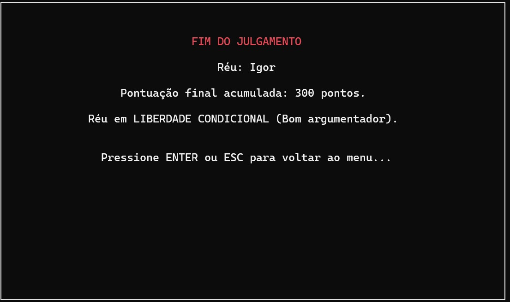
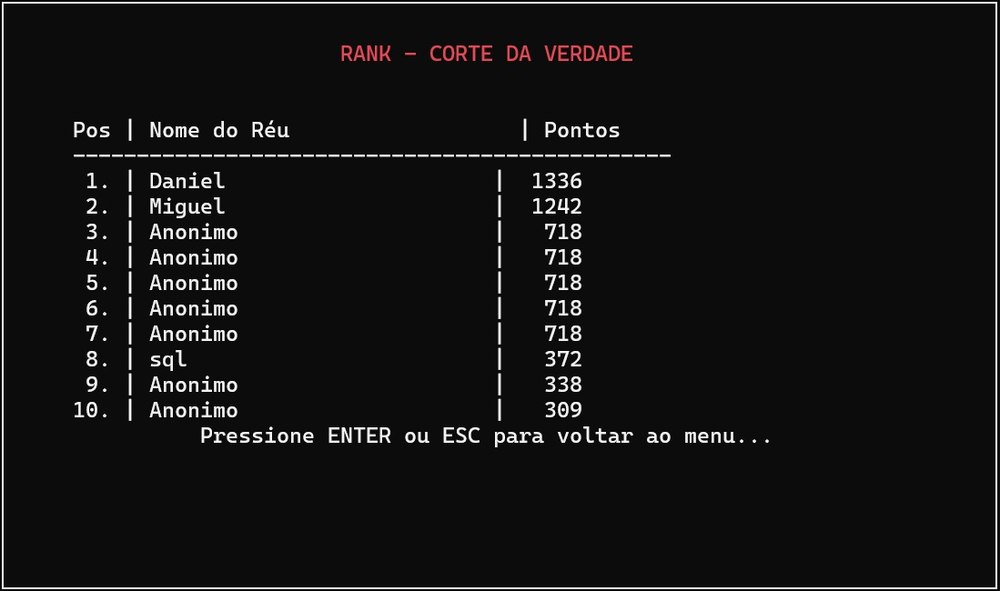

# 🏛️ Corte da Verdade: Jogo Educativo de Lógica Proposicional

[](https://isocpp.org/)
[](LICENSE)
[]()

---

## 🎮 Visão Geral do Projeto

O **Corte da Verdade** é um jogo interativo e educativo desenvolvido para o terminal, focado em **Lógica Proposicional**. Ele foi concebido para desafiar o jogador a aplicar conceitos de lógica, como tautologias e tabelas-verdade, em um ambiente de jogo envolvente.

Este projeto foi desenvolvido como trabalho final para a disciplina de **Programação Imperativa e Funcional - 2025.2** da **Cesar School**.

 

### 🎭 Tema e Narrativa
O jogador assume o papel de um **Réu** em um tribunal fictício onde ninguém pode mentir. Para vencer, é preciso construir argumentos irrefutáveis (tautologias) que o Juiz é obrigado a aceitar.

**Componentes do Jogo:**
O jogador deve construir **Fórmulas Bem Formadas (FBFs)** utilizando:
* **Variáveis**: `p`, `q`, `r`
* **Conectores**: `v` (ou), `^` (e), `~` (não), `→` (implica), `↔` (bi-implica)
* **Símbolos de Agrupamento**: `()` e `[]`

---

## 🎯 Objetivo do Jogador

Em cada nível, você recebe um conjunto limitado de peças lógicas (variáveis e conectores) e deve montar a **tautologia-alvo** daquele desafio.

* Você tem **3 tentativas por nível** para acertar a fórmula-alvo.
* **Não é permitido repetir a mesma expressão** no mesmo nível.

**O jogo contém:**
* **9 desafios principais** divididos em 3 níveis de dificuldade (Básico, Intermediário, Avançado).

### 📊 Níveis de Dificuldade

| Nível | Variáveis | Linhas da tabela verdade | Exemplo |
| :---: | :-------: | :----------------------: | :------ |
| Básico | até 1 (`p`) | 2 | `p v ~ p` |
| Intermediário | até 2 (`p`, `q`) | 4 | `(p ^ q) → p` |
| Avançado | até 3 (`p`, `q`, `r`) | 8 | `(p ^ (q v r)) → p` |

---

## 🔁 Estrutura de uma Rodada

1.  O jogo apresenta as peças lógicas disponíveis para a construção da fórmula.
2.  O jogador insere a **FBF** para julgamento.
3.  O resultado (acerto ou erro) é apresentado.
    
     
    
4.  Na 2ª tentativa, uma frase é apresentada, fornecendo um contexto narrativo à fórmula:
    
     
    
5.  Em caso de acerto:
    
     
    
6.  **Sistema de Pontuação Extra (Tabela Verdade):** Caso não acerte em nenhuma das três tentativas, o jogo monta a tabela verdade da última fórmula construída. Cada linha **VERDADEIRA (V)** da tabela verdade vale **1 ponto extra**.
    
     

---

## 🏆 Sistema de Pontuação

### ✔️ Pontos por Acerto

| Tentativa | Pontos |
| :---: | :---: |
| 1ª tentativa | **50 pts** |
| 2ª tentativa | **30 pts** |
| 3ª tentativa | **20 pts** |

### ⭐ Fase Bônus

Durante a fase bônus, os riscos e recompensas são maiores, focando na identificação de Sofismas/Silogismos:
* **Acerto (Sofisma/Silogismo correto):** Sua pontuação na rodada é **dobrada**.
* **Resposta Errada:** Você perde **metade dos pontos**.
* **Permanecer Calado (Passar):** Não há alteração de pontuação.
    
     

---

## 🚀 Como Instalar e Rodar

### Pré-requisitos

Certifique-se de ter um ambiente **Linux ou macOS** e o **GCC** (GNU Compiler Collection) instalado.

Verifique com:
```bash
gcc --version
```

## No Ubuntu/Debian, você pode instalar com:

sudo apt update
sudo apt install build-essential

# Passo a Passo

## 1. Clonar o Repositório
git clone [https://github.com/SEU-USUARIO/SEU-REPOSITORIO.git](https://github.com/SEU-USUARIO/SEU-REPOSITORIO.git)
cd SEU-REPOSITORIO

## 2. Baixar a Dependência (cli-lib)
O jogo utiliza a biblioteca cli-lib, responsável pelas funções de entrada e saída no terminal.

git clone [https://github.com/tgfb/cli-lib.git](https://github.com/tgfb/cli-lib.git)

## A estrutura final das pastas do projeto deve ser:

/seu-jogo
   ├── cli-lib/
   ├── src/
   ├── include/
   └── main.c

## 3. Compilar o Jogo
Ajuste o comando conforme a localização dos seus arquivos .c:

# Se os arquivos do seu jogo estiverem em /src
gcc ./src/*.c ./cli-lib/src/*.c -I./include -I./cli-lib/include -o jogo

# Se o main.c estiver na raiz do projeto
gcc main.c ./cli-lib/src/*.c -I./cli-lib/include -o jogo

## 4. Executar
Após compilar, execute o jogo:

./jogo

---

### 🔚 Encerramento
Ao fim da sessão:

* Sua pontuação total é calculada.
  


---

* Você pode entrar no **Ranking (Top 10)**.
  


---

**Atalhos:**
* **ENTER / ESC** voltar ao menu
* **ESC** durante o julgamento retorna ao menu **mantendo sua pontuação**

Você pode jogar novamente para tentar superar seu próprio recorde de pontuação.

---

## 🧑‍🤝‍🧑 Equipe

A equipe responsável por este projeto é composta por:

- **Heitor Didier** — [Eito2511](https://github.com/Eito2511)  
- **Luiz Felipe** — [LuizMXavier](https://github.com/LuizMXavier)  
- **Marcus Vinicius** — [Marcus-Vini-Tavares](https://github.com/Marcus-Vini-Tavares)  
- **Nicolly Rodrigues** — [nicky89ck](https://github.com/nicky89ck)  
- **Pedro Armando** — [pedrosol-dev](https://github.com/pedrosol-dev)  
- **Thomaz Barros** — [JustaTBC](https://github.com/JustaTBC)  
